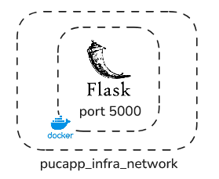
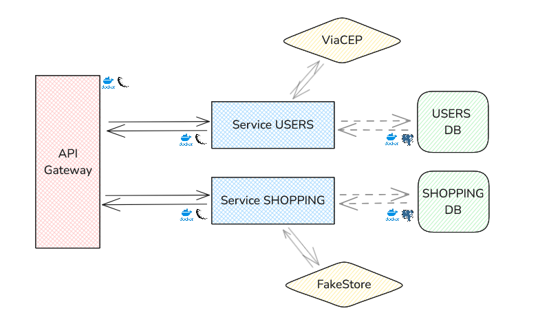
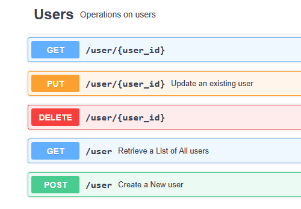
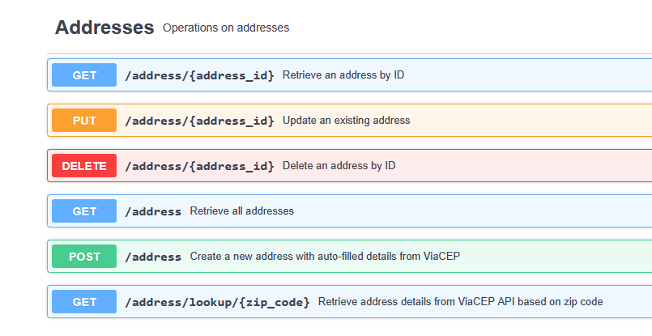
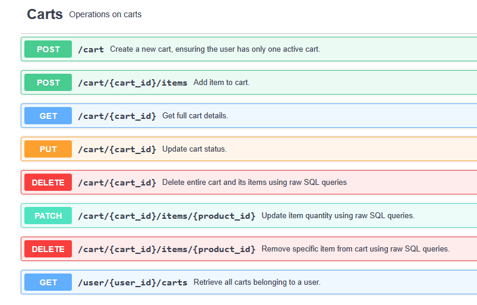
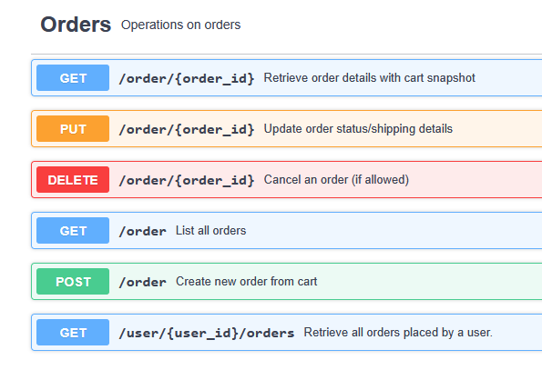
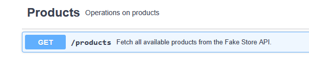

# PUCAPP SERVICE GATEWAY
Gilmar Neves

>
> 🧩 **Part of a Multi-Service Project**
>
> This service is one piece of a larger microservices-based project. You can find the related repositories below:
>
> - [**Infrastructure Service**](https://github.com/nevesgil/pucapp_infra)
> - [**Users Service**](https://github.com/nevesgil/pucapp_service_users)
> - [**Shopping Service**](https://github.com/nevesgil/pucapp_service_shopping)
> - [**Principal Gateway**](https://github.com/nevesgil/pucapp_principal_gateway)
>


## Summary

- [Introduction](#introduction)
- [Tech and Tools](#tech-and-tools)
- [Architecture](#architecture)
     - [Database Model](#database-model)
- [Use](#use)
    - [Endpoints](#endpoints)

### Introduction

PucappService is a MVP for evaluating the capabilities of Microservices in an app that serves the purpose of being a shopping service coupled with an users registering service.

The API GATEWAY SERVICE provides a Flask API (Python) for interacting with the other services in the same network and use their exposed endpoints and HTTP methods in a REST API as a proxy redirecting each request accordingly.

The API is exposed in port 5000.

### Tech and Tools
  


This API runs in the network created in the infrastructure service.
The service is built in Flask using other Python libraries such as Marshmallow for creating and validating schemas and SQLAlchemy for ORM.

The services it connects to run on ports 5001 (Users) and 5002 (Shopping).

The storage runs in another service and is accessed on port 5432 (PostgreSQL).

### Architecture

As this being the principal API of the service, we may use the complete architecuture to display the application as a whole.



```
> USERS

GET /user/{user_id}
PUT /user/{user_id}
DELETE /user/{user_id}
GET /user
POST /user

> ADDRESSES

GET /address/{address_id}
PUT /address/{address_id}
DELETE /address/{address_id}
GET /address/lookup/{zip_code}
GET /address
POST /address

> ORDERS

GET /order/{order_id}
PUT /order/{order_id}
DELETE /order/{order_id}
GET /order
POST /order
GET /user/{user_id}/orders

> CARTS

GET /cart/{cart_id}
PUT /cart/{cart_id}
DELETE /cart/{cart_id}
POST /cart
PATCH /cart/{cart_id}/items/{product_id}
DELETE /cart/{cart_id}/items/{product_id}
GET /user/{user_id}/carts

> PRODUCTS

GET /products
```

#### Database Model

The database models can be accessed each on the corresponding service repository given above.

### Use

>
> ⚠️ **Attention**
>
> Before running any service containers, **ensure the infrastructure services (e.g., database, network) are up and running**.
> Failing to do so may result in connection errors or failed startup for dependent services.
> 
> 🔗 The infrastructure service can be found [**here**](https://github.com/nevesgil/pucapp_infra).  
>

In order to use this for running the project, please follow the steps described below:

i) Clone the repository into your machine as:

```
git clone https://github.com/nevesgil/pucapp_service_users.git
```

ii) Go into the folder

```
cd pucapp_principal_gateway
```

iii) Run the docker compose file

Having the Docker up and running on your machine, you may simply run the command below to have the services running:

```
docker compose up -d --build
```

**Optional**

If you prefer, you may also use the commands:

```
docker build -t pucapp_principal_gateway .
```

```
docker run -d \
  --name pucapp_principal_gateway \
  -p 5000:5000 \
  -v "$(pwd)":/app \
  --network pucapp_infra_pucapp_network \
  pucapp_shopping

```

Obs:
When not using the service anymore, run:
```
docker compose down
```

iv) Access the service on https://localhost:5000


#### Endpoints

##### Users



##### Addresses



##### Carts



##### Orders



##### Products


